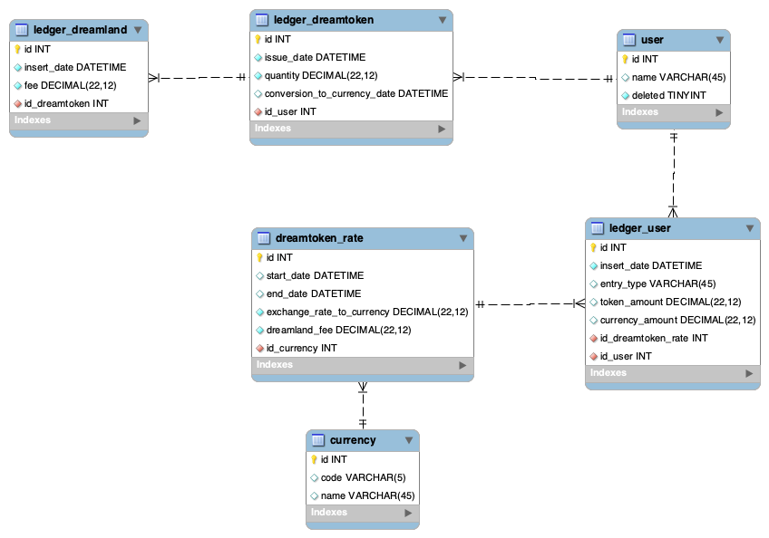

# Dreamland
## Questions
- Database table design given the APIs above
> SQL scripts of the DB are in src/resources/ddl_scripts.sql
> 
> ER is in dreamland_ER.png
> 

- Database needs to have a solid double-entry ledger to track the tokens and USD (might make sense to read up about ledgers - some great sources here and here). Let's design ledgers for both the tokens and USD
> I see you have put some references into the gist, I took a first read, but I need to learn more of the functional / financial aspect.

- Data types we can use for the ledger amounts (it needs to support the smallest and largest unit of a crypto token)
> I have used SQL DECIMAL (22,12) which means 10 digits before the comma and 12 digits after the comma. It can be extended up to 35 digits if needed

- Edge cases - list some edge cases both in APIs and database that you will handle
>- I thought at a DB structure you can have multiple currency, and multiple exchange currency rate (past or future) for the same currency, and configurable fee (fixed in absolute currency value per transaction)
>- if a user has less than 5 tokens, for example 4.80 and win 0.5 it should be trimmed to 0.2 to get 5 tokens in total

- Any other APIs and tools you can think of (no need to implement)
>- Automated Tests: not implemented at all
>- Error handling: there are thrown 400 errors for bad requests, 404 for endpoint not mapped or 500 in case of server error (generically), for example /stats/3 should respond a 404, after the user reaches 5 tokens, it should return a failure, or if rates is miscondigured... etc etc
>- Security: all the APIs are not secured, I'd suggest to setup an authentication mechanism
>- Logging and alerting: not implemented at all
>- There's no possibility to add dynamically a user (must be done manually into DB)
>- Table keys are Integer type (+2M range values), to make implementation easier but this might be not working for huge numbers

- Infrastructure - This is a global system with customers across the world. Let's discuss more about setting up the infra, how to share data across different regions, how to solve for region-specific data for issues like GDPR, how to replicate some tables out of a region to a central cluster for analytics, etc. This is just a textual answer with maybe some design diagrams
> The infrastructure is on the cloud (AWS is preferred), CI/CD is enabled thru github actions or jenkins. Databases are on clusters DBaS to enable HA and leverage scalability.
> The GDPR topic is really a pain, the simplest solution I can think is having separate instances of the applications 1 for EU and 1 outside EU, don't know if this is doable in the "Metaverse" scope. Users on GDPR can request all data deletion, so there's to forecast this scenario.
> Before ingesting the "central" analytics you can scrub personal information from dumped datasets (there are several tools) before sending.
